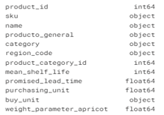
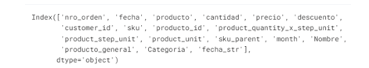
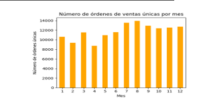
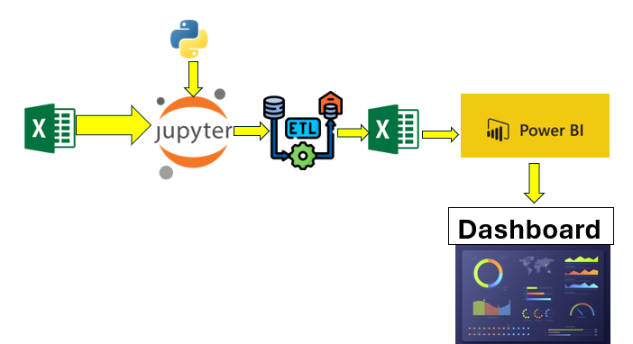
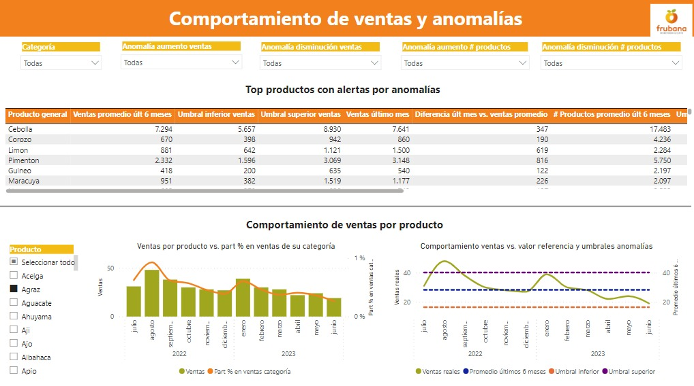
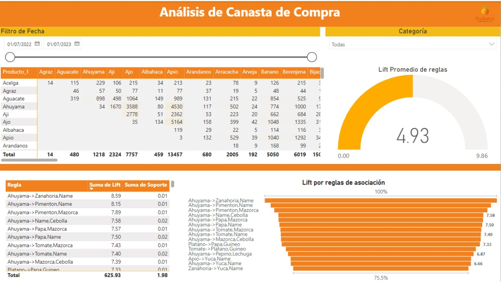

# Proyecto final de la Maestría en Inteligencia Analítica de Datos MIAD

## Video
https://youtu.be/35QuqUWg5QE


[](https://travis-ci.org/freddy120/MIAD_no_supervisado_project)

[](https://github.com/freddy120/MIAD_no_supervisado_project/issues)

[](https://opensource.org/licenses/MIT)

## TABLA DE CONTENIDOS
- [Resumen](#Resumen)
- [Analisis exploratorio de datos](#ANÁLISIS-EXPLORATORIO-DE-DATOS)
- [Codigo de marketbasket](#Codigo-de-marketbasket)
- [Codigo de anomalias](#Codigo-de-anomalias)
- [Arquitectura](#Arquitectura)
- [Manual de Usuario para Tableros de Control en Power BI](#Manual-de-Usuario-para-Tableros-de-Control-en-Power-BI)

# Titulo: Frubana

## Integrantes
* Laura Karina Rodriguez Arciniegas lk.rodrigueza1@uniandes.edu.co
* Jesica Andrea Vique Orjuela j.vique@uniandes.edu.co
* Christian Ali Saker Barrera c.saker@uniandes.edu.co
* Brayan Stiven Torres Ovalle b.torreso@uniandes.edu.co

# Resumen 
El Proyecto Frubana se divide en tres secciones principales: Análisis Exploratorio de Datos, Algoritmo de Detección de Anomalías y Modelo Market Basket.

En el **Análisis Exploratorio de Datos**, se realizó la lectura de 12 archivos de órdenes de ventas mensuales, consolidando un total de 502,154 registros. Los productos fueron procesados a partir de un archivo CSV, resultando en un dataframe final de 238 registros y cuatro columnas. Este análisis incluyó la transformación y depuración de datos, asegurando la eliminación de duplicados y la validación de la consistencia de los datos. El resultado fue un dataframe final que se utilizará como insumo para los algoritmos de detección de anomalías y análisis de canasta de compra.

Para la **Detección de Anomalías**, se evaluaron varios algoritmos, como Isolation Forest y One-Class SVM, antes de seleccionar un enfoque basado en desviaciones estándar. Este método, aunque sencillo y rápido de implementar, requiere que los datos sigan una distribución normal. Se realizaron ajustes manuales en los umbrales de desviación estándar para optimizar la detección de anomalías, determinando que un valor de desviación estándar de 2 era el más adecuado. Este modelo permite identificar productos con ventas significativamente por encima o por debajo del comportamiento esperado, generando alertas para estos casos.

Finalmente, el **Modelo Market Basket** se centró en el análisis de asociación utilizando el algoritmo Apriori. Este enfoque se basa en medidas de soporte, confianza y lift para identificar relaciones entre productos. Aunque se consideraron otros métodos como la descomposición de valores singulares (SVD) y la disimilaridad del coseno, se optó por Apriori debido a su efectividad en la identificación de patrones de compra. Este modelo permitirá a Frubana comprender mejor las combinaciones de productos más comunes en las ventas y optimizar su estrategia de ventas y marketing.


  
## ANÁLISIS EXPLORATORIO DE DATOS

## Órdenes de venta

Se realizó la lectura de 12 archivos .pkl con las órdenes de ventas mensuales de 1 año. Tras la unificación de estos archivos, se obtuvieron 502.154 registros y 14 columnas, obteniendo el dataframe `ventas_año_completo`. El mes con menor número de registros es abril (32.672) y el de mayor número de registros es marzo (46.944).


Volumen y tipos de datos originales:



## Productos

Se realizó la lectura de `Productos_BAQ.csv`. La tabla originalmente contiene 137 registros y 11 columnas. Se agregó la columna `producto_general`:



Luego de depuraciones y transformaciones, se obtuvo el dataframe `productos_final`, que contiene 238 registros y 4 columnas: `product_id`, `name`, `producto_general`, `category`.

## Principales validaciones y transformaciones aplicadas a los datos

- Se realizó cambio de `product_id` a tipo entero en el dataframe `ventas_año_completo`.
- La columna `producto_general` fue creada localmente para agrupar productos del mismo tipo. Ejemplo, todos los tipos de tomate tienen producto general `Tomate`.
- Se realizó el cruce del dataframe `ventas_año_completo` vs. la tabla de productos recibida originalmente, identificando 101 códigos de productos que figuraban en las órdenes de venta, pero no en la tabla de productos.
- Se completó la tabla de productos, incluyendo los `producto_id` faltantes asignándoles su respectivo `category` y `producto_general`. Como resultado se obtuvo el dataframe `productos_final`.
- Unión de `ventas_año_completo` y `productos_final` usando la llave `producto_id`.
- Se validó que no existen valores nulos en el dataframe resultante.
- Se eliminaron registros duplicados usando como llave la combinación de los 5 campos: `nro_orden`, `fecha`, `cantidad`, `custumer_id`, `Producto_id`. El dataframe resultante pasó de contener 502.154 a 501.636.
- No se realizó tratamiento de datos atípicos de ventas, dado que en caso de que existan se espera que el modelo de anomalías a implementar logre alertarlos.



## Codigo de marketbasket 

```python
# ...


soportes = [0.005,0.01,0.02]
confianzas = [0.5,0.7]
lifts = [2,4]

Parametros = {}
Cant_asociaciones = []

for supp in soportes:
    for conf in confianzas:
        for lift_valor in lifts:
            Parametros[supp,conf,lift_valor]=len(list(apriori(records, min_support=supp, min_confidence=conf, min_lift=lift_valor,max_length=3)))
# ...
df_calibracion = pd.DataFrame(Parametros.values(),index=Parametros.keys(),columns=['Registros']).sort_values('Registros')
indices = df_calibracion.index.tolist()

plt.plot(df_calibracion['Registros'].values,color='orange')
plt.xticks(ticks=range(len(df_calibracion.index)), labels=df_calibracion.index, rotation=90)
plt.title('Calibración de numero registros')
plt.show()
#df_calibracion['Registros'].values
# ...
association_rules = apriori(records, min_support=0.01, min_confidence=0.5, min_lift=4,max_length=3)
association_results = list(association_rules)
association_results

print("Derivamos {} reglas de asociación.".format(len(association_results)))
# ...
def Obtener_Metrica(num):
    item = association_results[num]
    pair = item[0] 
    items = [x for x in pair]
    
    #Productos_nombre,Soporte,Confianza,Lift
    try:
        regla = items[0]+'->'+items[1]+','+items[2]
    except:
        regla = items[0]+'->'+items[1]

    return (regla,item[1],item[2][0][2],item[2][0][3])

Lista_para_df=[]
for registro in np.arange(0,len(association_results)):
    Lista_para_df.append(Obtener_Metrica(registro))

df_Reglas_asociación = pd.DataFrame(Lista_para_df,columns=['Regla','Soporte','Confianza','Lift'])

def dibujar(df,columna):
    df = df.sort_values(columna,ascending=False)
    plt.figure(figsize=(15,5))
    plt.bar(x=df['Regla'],height=df[columna],color='orange')
    plt.title(columna + ' por asociación')
    plt.xticks(rotation=90,fontsize=6)
    for num,item in enumerate(df[columna]):
        plt.text(x=num,y=item,s=np.round(item,2),rotation=90,fontsize=6,va='bottom',ha='center')
    plt.show()

dibujar(df_Reglas_asociación,'Lift')
dibujar(df_Reglas_asociación,'Soporte'
# ...
```


## Codigo de anomalias
```python
# ...
#generacion del df con los umbrales de alertamiento por producto_general

# Filtrar los meses del 6 al 11, meses que se tomaran para calcular los umbrales de alertamiento
df_meses_ref = ventas_generales_mes[(ventas_generales_mes['month'] >= 6) & (ventas_generales_mes['month'] <= 11)]

# Agrupar por producto_general, product_unit y month y calcular el promedio y la desviación estándar
df_umbrales = df_meses_ref.groupby(['producto_general']).agg({
    'conteo_registros': ['mean', 'std'],
    'suma_cantidad': ['mean', 'std']
}).reset_index()

# Renombrar las columnas
df_umbrales.columns = ['producto_general', 
                    'promedio_conteo_registros', 'desviacion_conteo_registros', 
                    'promedio_suma_cantidad', 'desviacion_suma_cantidad']

sd=2 #definir la desviación estándar a considerar

# Calcular los umbrales de alertamiento
df_umbrales['umbral_inf_conteo'] = df_umbrales['promedio_conteo_registros'] - sd * df_umbrales['desviacion_conteo_registros']
df_umbrales['umbral_sup_conteo'] = df_umbrales['promedio_conteo_registros'] + sd * df_umbrales['desviacion_conteo_registros']
df_umbrales['umbral_inf_cantidad'] = df_umbrales['promedio_suma_cantidad'] - sd * df_umbrales['desviacion_suma_cantidad']
df_umbrales['umbral_sup_cantidad'] = df_umbrales['promedio_suma_cantidad'] + sd * df_umbrales['desviacion_suma_cantidad']

# Mostrar el nuevo DataFrame
df_umbrales.head(10)

# ...

# Mostrar el número de productos generales únicos en el consolidado deóordenes de venta:
print("Número de productos generales únicos en el consolidado ventas es:", df['producto_general'].nunique())


# Contar el número de alertas por cada item
num_alertas_dism = len(df_anomalia_dism)
num_alertas_dism_cant = len(df_anomalia_dism_cant)
num_alertas_aum = len(df_anomalia_aum)
num_alertas_aum_cant = len(df_anomalia_aum_cant)


# Obtener los productos generales únicos y contar el total de productos con anomalía
productos_dism = df_anomalia_dism['producto_general'].unique()
num_productos_dism = len(productos_dism)
productos_dism_cant = df_anomalia_dism_cant['producto_general'].unique()
num_productos_dism_cant = len(productos_dism_cant)
productos_aum = df_anomalia_aum['producto_general'].unique()
num_productos_aum = len(productos_aum)
productos_aum_cant = df_anomalia_aum_cant['producto_general'].unique()
num_productos_aum_cant = len(productos_aum_cant)


# Mostrar el resumen de anomalías identificadas
print("Resumen anomalías identificadas:")
print("Productos con anomalía por disminución número de ventas:",
      productos_dism.tolist(), "- Número de alertas:", num_alertas_dism)
print("Productos con anomalía por disminución cantidades vendidas:",
      productos_dism_cant.tolist(), "- Número de alertas:", num_alertas_dism_cant)
print("Productos con anomalía por aumento número de ventas:",
      productos_aum.tolist(), "- Número de alertas:", num_alertas_aum)
print("Productos con anomalía por aumento cantidades vendidas:",
      productos_aum_cant.tolist(), "- Número de alertas:", num_alertas_aum_cant)


# Calcular y mostrar el total de alertas
total_alertas = num_alertas_dism + num_alertas_dism_cant + num_alertas_aum + num_alertas_aum_cant
print("Total de alertas:", total_alertas)


# Combinar todos los productos generales únicos de los 4 criterios
productos_unicos_alertados = set(df_anomalia_dism['producto_general'].unique()) | \
                             set(df_anomalia_dism_cant['producto_general'].unique()) | \
                             set(df_anomalia_aum['producto_general'].unique()) | \
                             set(df_anomalia_aum_cant['producto_general'].unique())

# Calcular el total de productos generales únicos alertados
total_productos_unicos_alertados = len(productos_unicos_alertados)

# Mostrar el total de productos generales únicos alertados
print("Total de productos generales unicos alertados:", total_productos_unicos_alertados)

# Tasa de alertas por producto general
tasa_alertas_producto = (total_productos_unicos_alertados / df['producto_general'].nunique()) * 100
# Redondear la tasa de alertas a 2 decimales
tasa_alertas_producto = round(tasa_alertas_producto, 2)
# Mostrar la tasa de alertas por producto general
print("Tasa de alertas (producto_general): ", tasa_alertas_producto, "%")

# ...
```

## Arquitectura 



# Manual de Usuario para Tableros de Control en Power BI
### Comportamiento de Ventas y Anomalías

### Análisis de Canasta de Compra


Este manual de usuario te guiará a través del uso de dos tableros de control en Power BI: uno enfocado en el **Análisis de Canasta de Compra** y el otro en el **Comportamiento de Ventas y Anomalías**. Ambos tableros te ayudarán a entender y analizar mejor los datos de ventas y los patrones de compra de productos.

## Análisis de Canasta de Compra

### Descripción General
El tablero de **Análisis de Canasta de Compra** proporciona información sobre las asociaciones de productos en las canastas de compra de los clientes. Utiliza métricas como el "lift" para identificar reglas de asociación fuertes entre diferentes productos.

### Componentes del Tablero
1. **Filtro de Fecha**:
   - Puedes seleccionar un rango de fechas específico para analizar los datos de las canastas de compra dentro de ese periodo.

2. **Categoría**:
   - Permite filtrar los datos por categorías específicas de productos.

3. **Tabla de Productos**:
   - Muestra la cantidad de veces que un producto (Producto_1) aparece junto con otros productos en las canastas de compra.
   - Los productos se listan en filas y columnas, con los números en las celdas indicando la frecuencia de co-ocurrencia.

4. **Lift Promedio de Reglas**:
   - Un medidor circular que muestra el lift promedio de todas las reglas de asociación identificadas.

5. **Reglas de Asociación**:
   - Lista de reglas de asociación, donde se muestra la suma de lift y la suma de soporte para cada regla.
   - Ejemplo de reglas: "Ahuyama -> Zanahoria, Name" con un lift de 8.59 y un soporte de 0.01.

6. **Gráfico de Lift por Reglas de Asociación**:
   - Un gráfico de barras que visualiza el lift de las principales reglas de asociación.

### Cómo Usar el Tablero
1. **Selecciona el Rango de Fecha**:
   - Usa el deslizador o selecciona manualmente las fechas para ajustar el periodo de análisis.

2. **Filtra por Categoría**:
   - Utiliza el menú desplegable para enfocarte en una categoría específica si es necesario.

3. **Analiza la Tabla de Productos**:
   - Observa qué productos tienden a comprarse juntos. Esto puede ayudarte a planificar estrategias de marketing y promociones cruzadas.

4. **Interpreta el Lift Promedio**:
   - El lift promedio te indica la fuerza general de las asociaciones de productos. Un valor mayor a 1 indica una asociación positiva entre los productos.

5. **Revisa las Reglas de Asociación**:
   - Examina las reglas con mayor lift para identificar patrones de compra significativos.

6. **Utiliza el Gráfico de Lift**:
   - Observa visualmente cuáles son las reglas más fuertes en términos de lift.

## Comportamiento de Ventas y Anomalías

### Descripción General
El tablero de **Comportamiento de Ventas y Anomalías** te permite identificar comportamientos de ventas y detectar anomalías en las ventas de productos. Proporciona un análisis detallado de las ventas promedio, umbrales de ventas, y diferencias en las ventas mensuales.

### Componentes del Tablero
1. **Filtros de Categoría y Anomalías**:
   - Puedes filtrar por categoría de producto y por tipo de anomalía (aumento/disminución de ventas o número de productos).

2. **Top Productos con Alertas por Anomalías**:
   - Lista de productos que muestran anomalías en las ventas, con información sobre ventas promedio, umbrales y diferencias en las ventas.

3. **Gráfico de Ventas por Producto**:
   - Muestra las ventas mensuales por producto y la participación porcentual en las ventas de su categoría.

4. **Gráfico de Comportamiento de Ventas vs. Umbrales**:
   - Visualiza las ventas reales versus el promedio de los últimos 6 meses, y los umbrales inferior y superior de ventas.

### Cómo Usar el Tablero
1. **Selecciona los Filtros**:
   - Ajusta los filtros para enfocarte en categorías específicas de productos o en tipos de anomalías que deseas investigar.

2. **Analiza los Productos con Anomalías**:
   - Revisa la tabla para identificar productos que tienen comportamientos de ventas fuera de los umbrales esperados.
   - Observa las diferencias entre las ventas del último mes y las ventas promedio para detectar posibles problemas o éxitos inesperados.

3. **Observa el Gráfico de Ventas por Producto**:
   - Compara las ventas mensuales de cada producto y su participación en la categoría a lo largo del tiempo.
   - Esto te ayudará a entender tendencias estacionales o cambios en la demanda.

4. **Interpreta el Gráfico de Comportamiento de Ventas vs. Umbrales**:
   - Compara las ventas reales con los umbrales para determinar si las ventas están dentro del rango esperado.
   - Un valor fuera del umbral puede indicar una anomalía que necesita ser investigada.

### Ejemplo de Uso
- Si notas que las ventas de "Cebolla" están significativamente por encima del umbral superior, esto puede indicar una demanda inusualmente alta que podría requerir ajustes en el inventario.
- Analizando las reglas de asociación, si "Ahuyama" se vende frecuentemente con "Zanahoria" y "Name", puedes considerar promociones conjuntas o paquetes de productos.

## Conclusión

 La herramienta entregada "Análilis de canasta de compra" le permitirá a Frubana identificar las combinaciones de productos con valores significativos de: soporte, lift y confianza.Esta información es insumo clave para la definición de estrategias de promoción o reubicación de productos, que facilitarán el aumento en  venta cruzada de productos y del número de unidades vendidas por orden.

La  herramienta entregada "Detección de anomalías" le permitirá a Frubana identificar los productos con comportamientos atípicos de venta en el último mes. Esta información es insumo clave para la definición de estrategias de venta, promoción y/o liquidación de productos, tal que pueda mejorarse la eficiencia operativa y la rotación de inventario. 


## Prototipo Fachada

| Extracción | Transformación / Carga | Análisis | Uso | Enfoque | Requerimiento | Criterio o métrica de evaluación | Lógica del sector |
|------------|------------------------|----------|-----|---------|----------------|-------------------------------|-------------------|
| **Fuentes de datos requeridas:**<br><br> 1. Tablas de ventas: <br> 12 archivos .pkl, un archivo por mes correspondiente a las ventas del año 2023 para la región de Barranquilla.<br> Los 12 archivos incluyen 502.154 registros y 14 columnas. <br><br> 2. Tabla de producto: <br> Formato CSV. <br> La tabla incluye 137 registros y 11 columnas. | **Fuentes y características de los datos:**<br> -Tabla de productos: debe especificar por id de producto, minimamente: <br> Nombre producto, categoría del producto. <br> -Ordenes de venta: deben incluir el id de producto que corresponde a la llave respecto a la tabla de producto. <br> Cada orden de venta debe incluir minimamente: <br> id de producto, fecha de venta, número de orden de venta, unidades vendidas. <br><br> **Formatos o condiciones de los datos:**<br> -Fecha de venta: formato fecha yyyy-mm-dd<br> -Unidades vendidas no puede contener valores menores o iguales a 0. <br><br> **Principales transformaciones:**<br> -Unir los 12 archivos de ventas: consolidado de ventas. <br> -Creación variable producto general en la tabla producto: ejemplo para 5 tipos de tomate, agruparlos como "Tomate". <br> -Posteriormente unir el consolidado de ventas, con la información de la tabla de producto de: Nombre producto, producto general y categoría a través de id producto. <br> -Limpiar datos nulos según: id del producto, nombre producto, número orden, categoría producto. <br> -Eliminar ordenes de venta cuya cantidad de venta por producto sea menor igual a 0. <br> -Cálculo de frecuencia de ventas por pares de productos <br> -Construcción de matriz de frecuencias de ventas por pares de productos <br> -Cálculo de support y lift por pares de productos. <br> -Cálculo de valor de referencia de ventas por producto (promedio de los últimos 6 meses, excluyendo el último mes) <br> -Creación de umbrales para alertamiento por producto general: <br> Umbral inferior: promedio-sd <br> Umbral superior: promedio+sd. <br> Se validará el desempeño del algoritmo de alertamiento con 1,2 y 3 desviaciones estándar. <br> -Flag anomalía por disminución: 1 aplica (valor referencia < umbral inferior), 0 no aplica <br> -Flag anomalía por aumento: 1 aplica (valor referencia > umbral superior), 0 no aplica. | **Preguntas a abordar:** <br> 1. ¿Cuáles son los principales pares de productos con asociación positiva y alta frecuencia de ventas? <br> 2. ¿Cuáles son los principales productos qué presentan un comportamiento anómalo de ventas en el último mes? <br> 3. ¿Cuál es el comportamiento de ventas histórico por tipo de producto general (ejemplo: Tomate) o por categoría (Ejemplo: Frutas)?. <br> 4. ¿Cuál es la probabilidad de ocurrencia por par de productos en una misma venta? (Support). <br><br> **El enfoque analítico es descriptivo.** <br><br> **Técnicas y algoritmos a involucrar:** <br> 1. Market Basket Analysis: Matriz de frecuencia de ventas por pares de productos y el cálculo de support y lift. <br> 2. Algoritmo de detección de anomalías con base en ventas históricas por producto en los últimos 6 meses, definición de umbrales de alerta con base en desviación estándar respecto al promedio. <br> 3. Gráficas de series de tiempo. <br> 4. Técnicas de exploración y minería de datos | **La herramienta para el desarrollo del dashboard es Power BI.** <br><br> El procesamiento de datos se hará haciendo uso de: Excel y Python. <br><br> **Usuarios finales:** Gerente de ventas, Gerente de producto y analistas de datos asociados a dichas gerencias. <br><br> **Las principales funcionalidades del dashboard incluyen:** <br><br> -Matriz de frecuencia de ventas por pares de productos. <br> -Top pares de productos según lift y frecuencia de ventas. <br> -Gráfica de ventas históricas con filtro por tipo producto general (ejemplo: Tomate) <br> -Top de alertas de productos con comportamiento anómalo de ventas en el último mes <br> filtro: Categoría de producto (Verduras, frutas, tubérculos). | Market Basket Analysis | R1. Entrega de ranking de pares de productos con lift mayor a 1, según matriz de frecuencia de ventas como parte de Market Basket Analysis, que permita al negocio mejorar estrategias de venta cruzada de productos | Satisfacción del cliente mayor o igual al 70% mediante aplicación de encuesta | **La audiencia de nuestro artefacto corresponde al área de ventas y producto de Frubana.** <br><br> **Externalidades a tener en cuenta:** situaciones puntuales que hayan afectado significativamente el comportamiento de ventas no fueron informadas por parte del cliente. Ejemplo: variaciones por cierre de operaciones y/o eventos promocionales. <br><br> El artefacto final corresponde a un dashboard que contempla los principales resultados en relación a la venta de productos con 2 principales enfoques: <br> -Market basket analysis (por pares de productos) <br> -Detección de anomalías del comportamiento de ventas (por producto). |
| | Market Basket Analysis | R3. Consistencia del ranking de pares de productos según lift y frecuencia de ventas | **Los pares de productos en ranking deben:**<br><br> 1. Tener lift mayor a 1: Un valor de lift mayor que 1 indica una asociación positiva entre -A y B. Cuanto mayor sea el valor de lift, más fuerte es la asociación. <br><br> **Fórmulas:**<br> -Lift(A -> B) = Soporte(A -> B) / (Soporte(A) * Soporte(B)). <br> -Soporte(A -> B) = Número de transacciones que contienen A y B / Número total de transacciones. <br><br> 2. Estar organizados de mayor a menor frecuencia de ventas. |
| | Detección de anomalías respecto al comportamiento histórico de ventas por producto | R2. Entrega del top de alertas de productos con comportamiento anómalo (con mayor aumento y disminución de ventas), que permita al negocio implementar acciones de control | Satisfacción del cliente mayor o igual al 70% mediante aplicación de encuesta |
| | Detección de anomalías respecto al comportamiento histórico de ventas por producto | R4. Consistencia del algoritmo de alertamiento para la identificación de productos con comportamientos anómalos de ventas en el último mes con base en el comportamiento de los últimos 6 meses | **Verificación de reglas de alertamiento:**<br><br> -El valor de referencia de ventas por producto se debe corresponder al promedio de ventas de los últimos 6 meses. <br><br> **Los valores detectados como anomalías deben ser:**<br> -Menores a: promedio - sd<br> -o mayores a: promedio+ sd<br> (Según el valor seleccionado para la desviación estándar:1sd,2sd o 3sd) |
| | Tablero de control | R5. Visualización amigable del tablero de control, incluyendo 2 vistas: <br> -Top pares de productos según lift y frecuencia de ventas <br> -Top de alertas de productos con comportamiento anómalo de ventas en el último mes | Cumple |
| | Tablero de control | R6. Tablero de Control desarrollado en Power BI | Cumple |
